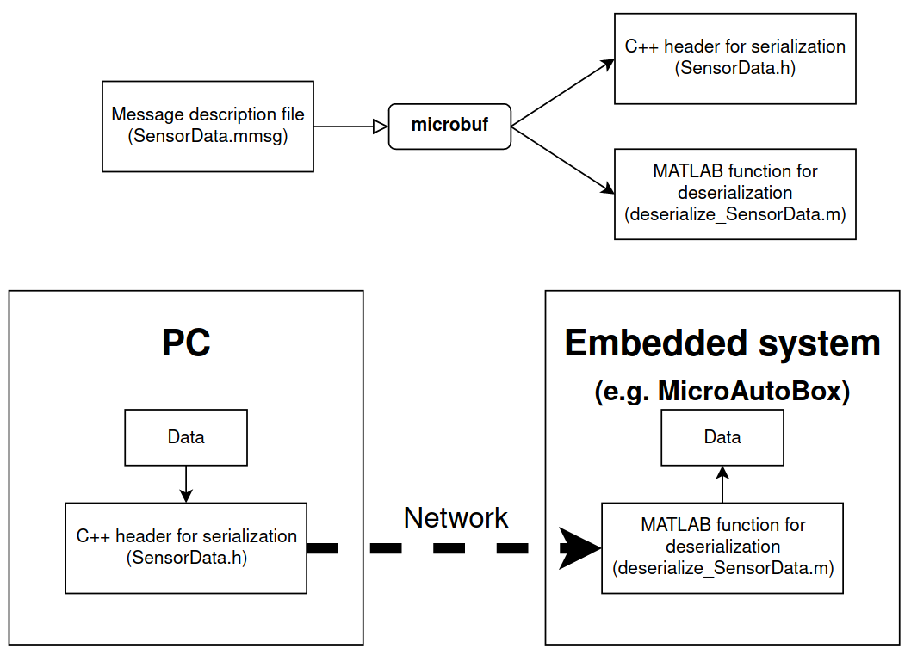

# microbuf
Data serialization toolchain for C++ and embedded systems with MATLAB support



## Who might want to use `microbuf`?
You might want to use it if you plan to create an interface between a computer and an embedded system with MATLAB support, possibly using network protocols like TCP or UDP. 
One possible use case would be "Send control data from computer over UDP to embedded system". 
The number of supported languages is currently pretty limited - only C++ for serializing (Tx) and MATLAB for deserializing (Rx). 
This makes it possible to e.g. send data from a [ROS](https://www.ros.org/) node to a [dSPACE MicroAutoBox](https://www.dspace.com/en/inc/home/products/hw/micautob/microautobox2.cfm).
The Endianness of the systems will automatically be considered during compilation.
Due to the structure of the project, support for more languages can be added with reasonable effort.

## Why not just use `protobuf`/`JSON`/`matlab-msgpack`/...?
Using another framework with more features like [protobuf](https://github.com/protocolbuffers/protobuf) may indeed make sense in many cases.
`microbuf` is intended for use cases with strong limitations, e.g. embedded systems.
`microbuf` does not depend on external libraries and a compilation just using standard language tools
is possible.

[matlab-msgpack by bastibe](https://github.com/bastibe/matlab-msgpack) cannot be compiled to C code with Simulink/MATLAB coder.

## What kind of data can be sent?
The following data types are currently supported:
 - `boolean`
 - Unsigned integers: `uint8`, `uint16`, `uint32`, and `uint64`
 - Floating point: `float32`, `float64`
 - Arrays of the above with a static size
 
## What languages are supported?

| Language | Serialization | Deserialization | CRC support | Examples | Notes |
|---|---|---|---|---|---|
| C++ | ✔ | ✘ | ✔ | ROS node; C++ application | Needs `std::vector` right now |
| MATLAB | ✘ | ✔ | ✔ | dSPACE MicroAutoBox; Simulink simulation | Usable in Simulink; compiles with Simulink/MATLAB Coder |
| ... | ✘ | ✘ | ✘ | | Please open a feature request or PR for new target languages |

## How does it work?
`microbuf` uses message description files ending with `.mmsg` for describing the structure
of messages, not unlike ROS. 
`mmsg` files need to follow a specific structure and must be valid `YAML`. 
The following example can be saved as `SensorData.mmsg` and then be used as a `microbuf` message:

```yaml
version: 1
append_checksum: yes
content:
  distance: float32[10]
  angle: float32[10]
  robot_id: uint8
```

When you now execute `./microbuf.py SensorData.mmsg`, serializers and deserializers for the supported languages will automatically be generated.
You can use the serializers to convert data to bytes, send them to your receiver (e.g. via TCP or UDP), and decode them there with the deserializers.

## How is the data serialized?
`microbuf`'s serialization is based on the 
[MessagePack specification](https://github.com/msgpack/msgpack/blob/master/spec.md).
All data elements are packed into a flat array and an optional CRC16 checksum is appended.

## Example: C++ application to Simulink
Suppose you want to send the message `SensorData.mmsg` mentioned above from a computer (using C++, e.g. a ROS node) to a Simulink simulation.
`microbuf` will generate a header file `SensorData.h` which you can include in your C++ code.
This message header file needs access to the `microbuf.h` header file, so just copy both files to the same folder where your compiler will find them or adapt your `CMakeLists.txt`.
You can then use the struct `SensorData_struct_t` in C++ to fill in your data and convert them to a byte vector, e.g. like this:

```cpp
SensorData_struct_t sensor_data;
// fill example data into SensorData msg
for(size_t i=0; i<10; ++i)
{
    sensor_data.distance[i] = 2.5*static_cast<float>(i);
    sensor_data.angle[i] = 4.2*static_cast<float>(i);
}
sensor_data.robot_id = 42U;

const auto bytes = sensor_data.as_bytes(); // convert to bytes
```

`bytes` now needs to be sent to the receiver system somehow, e.g. via UDP. 
The `examples` folder contains [an example](examples/cpp_to_simulink_via_udp/udp_sender.cpp) how one could do it.

The Simulink simulation can be configured to receive the serialized bytes.
This can be achieved e.g. with the [UDP Receive block](https://www.mathworks.com/help/dsp/ref/udpreceive.html) from the DSP System Toolbox.
By adding the file `deserialize_SensorData.m` which `microbuf` generated to the Simulink model, you can then easily deserialize the received data:


Note that in order to simulate or compile such a model, the `matlab` folder of `microbuf` needs to be on your MATLAB path because it contains necessary functionality which is not included in `deserialize_SensorData.m`.
You can of course also just copy the contained `+microbuf` folder to a place in your project which is on your MATLAB path anyway. 

## Example: ROS C++ node to dSPACE MicroAutoBox
Largely the same things need to done for this example as for the previous one.
The code can mostly be reused.
You need to include the necessary C++ code in your ROS node and think about when you want to send a message to the MicroAutoBox (e.g. with which rate).

On the MicroAutoBox side, you cannot use the same UDP Receive block because you need a hardware-specific one. 
A similar UDP Receive block is included in the RTI Ethernet (UDP) Blockset though, so you can use that one instead.
Note that the maximum payload of UDP packets for this blockset is 1472 bytes, according to the documentation.
The deserialization function can be included as in the previous example and will be compiled to C code automatically.

## Limitations

- Consider the maximum UDP payload for your usecase. `microbuf` knows the required number of bytes, see e.g. the `bytes.reserve(...)` call of the generated C++ struct's `as_bytes()` function.
- The generated C++ header cannot be used with e.g. Arduinos at the moment as it requires `std::vector`. This can be fixed in the future though.
- Only arrays with a static size are supported. You could only fill an array partially and add a field storing the number of valid elements though.